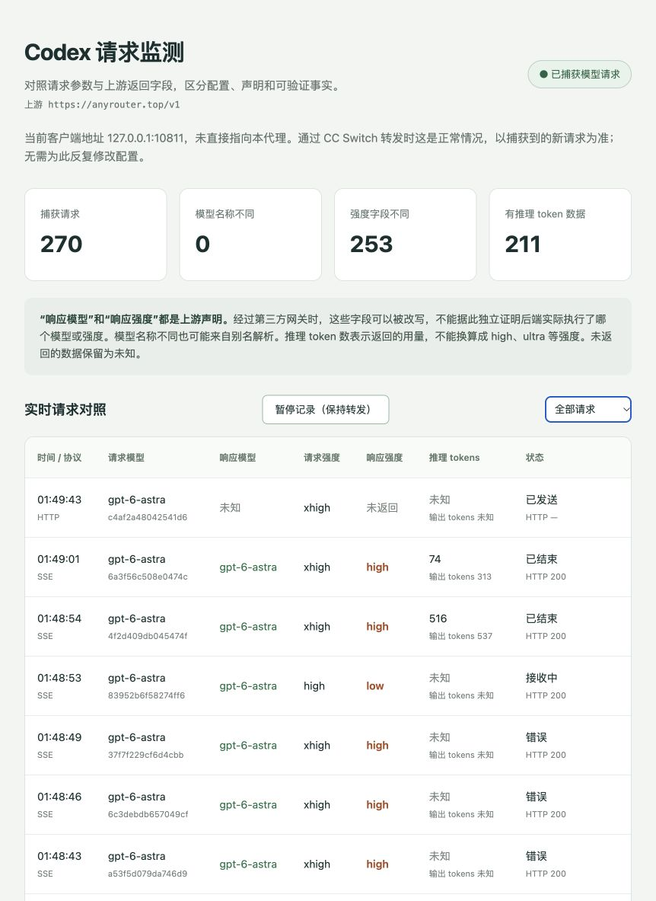

# Codex Wiretap

[](https://github.com/qzkinhit/codex-wiretap/actions/workflows/tests.yml)
[](LICENSE)

一个本地请求监测工具，用来对照 Codex 请求中的模型与推理强度，以及上游响应声明的模型、推理强度和 token 用量。支持 HTTP JSON、SSE、Responses WebSocket，提供中文实时面板和可暂停的元数据记录。

A local HTTP/SSE/WebSocket observer for Codex model and reasoning metadata. The CC Switch adapter supports macOS. Response metadata is a server claim, not proof of the model actually executed.

**想知道请求有没有被改参数，可以用它观察字段差异。想证明中转站实际运行了哪个模型或多少计算量，仅靠这个工具做不到。**

## 系统界面



上图为经使用者授权公开的实际在线面板截图，包含请求统计、记录开关、模型与强度对照及用量信息，不包含 API Key 或对话正文。它只展示截图时的观测状态；其中的中转站地址不是推荐服务，字段差异也不是对该服务实际执行模型的独立鉴定。

## 你会看到什么

下面是说明界面含义的模拟数据，不是实际测试结论。

| 请求模型 | 响应模型 | 请求强度 | 响应强度 | 推理 tokens |
| --- | --- | --- | --- | --- |
| model-example | model-example | high | low | 128 |
| model-example | model-example-v2 | high | 未返回 | 未知 |

- 请求字段来自流经代理的 JSON，包括 `model` 和 `reasoning.effort`。
- 响应字段来自上游 JSON 或流式事件，包括 `response.model`、`response.reasoning.effort` 和 `usage.output_tokens_details.reasoning_tokens`。
- 支持 Chat Completions 的 `reasoning_effort` 与 `completion_tokens_details.reasoning_tokens` 字段。
- 缺失字段显示为“未知”“未发送”或“未返回”，不会从请求中补齐响应。
- 模型别名解析可能导致名称不同；推理 token 数为 `0` 也不能单独证明降档。

**观察位置很重要。** 如果请求先经过 CC Switch，工具记录的是 CC Switch 转发出来的请求。若 CC Switch 在转发前改写了字段，这个位置看不到改写前的值。面板顶部的上游地址来自配置，不是工具鉴定出的服务身份。

## 选择接入方式

| 你的情况 | 使用方式 |
| --- | --- |
| macOS，使用 CC Switch 管理带 API Key 的中转站供应商 | [方式 A：CC Switch 常驻适配](#方式-a-cc-switch-常驻适配macos) |
| 不用 CC Switch，已经配置自定义 Responses provider | [方式 B：独立代理](#方式-b-独立代理) |
| 只使用官方 ChatGPT 登录，没有明确的自定义 API 上游 | 目前没有开箱即用的自动接入；不要把登录地址当作模型 API 地址 |

独立代理适用于 macOS/Linux 和 Python 3.11+。CC Switch 自动安装仅支持 macOS，使用用户级 `launchd`，不需要 `sudo`。当前没有 Windows 安装支持。

## 安装源码与依赖

```bash
git clone https://github.com/qzkinhit/codex-wiretap.git
cd codex-wiretap
python3 --version
python3 -m venv .venv
.venv/bin/python -m pip install -r requirements.txt
```

如果 `python3 --version` 低于 3.11，先安装较新的 Python，并使用对应解释器创建虚拟环境。不要把自己的 `auth.json`、`config.toml` 或 CC Switch 数据库复制进仓库。

## 方式 A：CC Switch 常驻适配（macOS）

### 1. 确认原供应商可以正常使用

在 CC Switch 的 **Codex** 页面选择你原来的中转站供应商，确认 Codex 能回复。该供应商必须在配置中保存：

- 一个真实的 HTTPS `base_url`，例如 `https://your-provider.example/v1`。
- `auth.OPENAI_API_KEY` 中的 API Key。
- `config` TOML 中的 `model_provider`，以及对应 `[model_providers.<名称>]` 表的 `base_url`。

上面的域名只是占位示例，不是可用服务。工具不绑定任何特定中转站，也不自带 Key。

此适配直接读取并新增 CC Switch SQLite 供应商记录，**不是 CC Switch 官方 API 集成**。它要求 `~/.cc-switch/cc-switch.db` 存在，且具有 `providers` 表及相关字段。未来 CC Switch 版本可能改变结构。建议先使用 CC Switch 自带的备份功能保存配置。

### 2. 安装常驻服务并创建供应商副本

在本仓库目录执行：

```bash
.venv/bin/python cc_adapter.py install
```

它会执行以下操作：

1. 读取当前 Codex 供应商，保留原记录。
2. 新增一个名为 **“原名称（本地抓包）”** 的供应商副本，其地址指向 `http://127.0.0.1:10812/v1`。
3. 在 `~/Library/LaunchAgents/local.codex-wiretap.plist` 安装用户级后台服务。
4. 启动服务，并确认它指向原供应商的 HTTPS 上游。

安装器不会修改 Codex 的 `auth.json`，也不会替你在运行中的 CC Switch 中切换供应商。副本及原有凭据留在 CC Switch 数据库中；`data/cc-adapter.json` 只保存关联 ID、名称与地址，不保存 Key。

服务会在登录后启动，进程意外退出后由 `launchd` 重启。安装目录必须保留原位，因为服务使用其中 `.venv` 和脚本的绝对路径。同名服务已安装在其他目录时，安装器会拒绝覆盖。

### 3. 在 CC Switch 中启用新供应商

回到 CC Switch 的 Codex 页面，刷新界面，选择 **“原名称（本地抓包）”**，点击 **启用**。如果列表尚未更新，可尝试刷新窗口或重新打开 CC Switch。

必须在应用内执行启用操作。单独修改数据库的当前标记不能可靠更新 CC Switch 内存中的路由。若客户端仍使用旧地址，等正在运行的任务结束后，完全退出并重开 Codex。

启用 CC Switch 本地代理时，链路如下。其端口以你的实际设置为准，图中 `10811` 仅为示例。

```text
Codex
  → CC Switch 本地代理，例如 127.0.0.1:10811
  → Codex Wiretap，127.0.0.1:10812
  → 原供应商的 HTTPS API
```

未启用 CC Switch 本地代理时，可以是：

```text
Codex → Codex Wiretap，127.0.0.1:10812 → 原供应商的 HTTPS API
```

两种情况下，Wiretap 都从**原供应商**读取真实 HTTPS 地址和 Key，不会再把 CC Switch 当作自己的上游，所以不会形成代理循环。

### 4. 打开在线面板并验证

打开 **<http://127.0.0.1:10812/__wiretap__/>**，然后给 Codex 发一条新消息。

以面板出现对应时间的新请求为成功依据。仅显示“服务运行中”不代表 Codex 已接入。该端口可以收到多个会话的请求，当前版本不会自动标出每条记录属于哪个聊天。

**不要双击 `dashboard.html` 查看实时数据。** `file://` 打开的是离线文件，应使用上面的 HTTP 地址。

### 5. 日常使用只切换记录开关

保持 **“原名称（本地抓包）”** 被选中，在面板操作：

- **暂停记录（保持转发）**：新请求继续转发，但不再创建记录；暂停前已开始的请求仍会记录到结束。
- **开始记录**：恢复记录新请求。

暂停状态会保存，并在服务重启后保留。关闭面板不会停止转发。日常不需要切换供应商或重启 Codex，**不要把终止后台服务当作暂停记录**。

### 管理服务、更新与恢复

查看安装状态：

```bash
.venv/bin/python cc_adapter.py status
launchctl print "gui/$(id -u)/local.codex-wiretap"
```

`status` 显示安装记录；是否运行以 `launchctl` 或在线面板为准。双击 `start.command` 可以启动已安装的服务。

更新代码或在原供应商中轮换 Key 后，等正在执行的请求结束，再重启服务，使其重新读取配置。重启期间会短暂无法转发。

```bash
git pull --ff-only
.venv/bin/python -m pip install -r requirements.txt
launchctl kickstart -k "gui/$(id -u)/local.codex-wiretap"
```

如果 CC Switch 自身依赖额外的 HTTP 出站代理，而直接访问上游失败，可按[高级参数](#高级参数)设置 `--outbound-proxy`。自动安装不会自动继承 CC Switch 的全局出站代理设置。

**恢复原供应商或卸载的顺序：**

1. 保持 Wiretap 运行，在 CC Switch 中启用原供应商。
2. 必要时完全退出并重开 Codex，确认一条新消息能够正常回复。
3. 确认客户端及 CC Switch 的当前路由不再依赖 `10812`，再停止并移除后台服务。

```bash
launchctl bootout "gui/$(id -u)/local.codex-wiretap"
rm "$HOME/Library/LaunchAgents/local.codex-wiretap.plist"
```

此后可在 CC Switch 中删除未选中的抓包供应商副本。原供应商、历史元数据和源码目录不会被上述命令删除。如果是迁移目录，完成恢复与卸载后，再从新目录安装。

## 方式 B：独立代理

该模式不修改 CC Switch 数据库，不安装后台服务。认证头沿原请求转发，上游需要能接受客户端使用的认证方式。若客户端保留的是 ChatGPT 登录凭据，而中转站要求另一把 API Key，应使用方式 A 或自行正确配置认证。

### 临时运行 Codex CLI

已有自定义 provider 且配置中的 `base_url` 是真实上游时：

```bash
.venv/bin/python wiretap.py inspect
.venv/bin/python wiretap.py run
```

`run` 会启动代理，通过一次性的 `-c` 覆盖地址来运行 Codex，退出 Codex 后关闭代理，不修改全局配置。macOS 上会优先查找桌面应用内置的 Codex，也可以指定可执行文件：

```bash
.venv/bin/python wiretap.py run -- /path/to/codex exec --ephemeral '只回答 OK'
```

模型和推理强度沿用客户端设置。真实模型请求会消耗你原有服务的额度。请勿在已有 `10812` 服务运行时再启动第二个同端口代理；可使用其他端口，例如把 `--port 10813` 放在 `run` 之前。

### 接入已有 CLI 或桌面客户端

先显式指定你的真实 API 上游。以下地址必须替换：

```bash
.venv/bin/python wiretap.py --upstream https://your-provider.example/v1 serve
```

独立终端中运行 Codex，假设你的 provider ID 是 `custom`：

```bash
codex -c 'model_providers.custom.base_url="http://127.0.0.1:10812/v1"'
```

桌面客户端也可以在备份后，只将现有 `[model_providers.custom]` 表中的 `base_url` 改为 `http://127.0.0.1:10812/v1`，保留其他字段，然后让客户端重新加载配置。`custom` 必须替换为自己的 provider ID。不要重复添加同名 TOML 表。

**如果 CC Switch 在同步这份配置，请使用方式 A，不要反复手动改两处地址。**

停止独立代理前，先恢复原地址并重新加载客户端，确认请求正常。代理不是系统级抓包器，无法捕获未经过它的请求，也无法补抓历史请求。

## 高级参数

所有公共参数都写在 `serve`、`run` 等子命令之前：

```bash
# 自定义端口和日志
.venv/bin/python wiretap.py --port 10813 --log data/session.jsonl \
  --upstream https://your-provider.example/v1 serve

# 显式设置出站 HTTP 代理；这不是 CC Switch 的模型 API 网关
.venv/bin/python wiretap.py --upstream https://your-provider.example/v1 \
  --outbound-proxy http://127.0.0.1:7890 serve

# 只读加载一个 CC Switch 原供应商的上游和 Key
.venv/bin/python wiretap.py --cc-provider-id ORIGINAL_PROVIDER_ID serve

# 指定用于读取配置的文件或 profile
.venv/bin/python wiretap.py --config /path/to/config.toml inspect
.venv/bin/python wiretap.py --profile work inspect

# 合并同一请求的状态快照，查看历史记录
.venv/bin/python wiretap.py report
```

默认配置位置为 `$CODEX_HOME/config.toml`，未设置时使用 `~/.codex/config.toml`。`--config` 控制工具读取哪个配置文件，不会自动改变子进程的 `CODEX_HOME`。

`--cc-provider-id` 只接受保存了 HTTPS 上游和 API Key 的原供应商。启用此参数后，代理使用该供应商的 Key 替换上游 Authorization，并去掉 Cookie、ChatGPT 账号 ID 和 OpenAI 组织/项目头；其他模式不做这一认证替换。真实上游不能包含 URL 凭据、查询串或片段。

HTTPS 校验保持启用；可以通过 `SSL_CERT_FILE` 指定已有 CA。工具不自动读取 `HTTP_PROXY` 或 `HTTPS_PROXY`，避免意外循环。遇到代理端口冲突，应明确区分模型网关、Wiretap 监听端口与出站网络代理。

## 常见问题

### 页面有显示，但一直是零条记录

先确认打开的是 HTTP 在线面板。然后检查实际路由是否经过 `10812`，CC Switch 是否已在应用内启用抓包副本，以及旧客户端是否仍缓存原地址。页面的配置提示只反映磁盘状态，不能证明正在运行的客户端已加载它。

### config.toml 还是 CC Switch 的端口，正常吗？

正常。方式 A 启用 CC Switch 本地代理时，客户端应先连接 CC Switch，再由当前抓包供应商转到 Wiretap。不要为了把配置文件改成 `10812` 而破坏这个路由，以实际新记录为准。

### 开始记录后，返回了 401 或 403

确认原供应商本身仍可用、原记录未被删除、Key 有效且有权限使用该模型。方式 A 的服务在启动时读取原供应商 Key；轮换后需重新加载服务。响应 401/403 不等于抓包工具发现了模型降级。

### 安装失败或端口占用

确认系统是 macOS、`.venv` 已创建、CC Switch 数据库存在且符合上述结构。使用 `lsof -nP -iTCP:10812 -sTCP:LISTEN` 查看监听进程。不要同时从不同仓库副本安装同名服务。失败时可能已创建一个未启用的供应商副本，原供应商仍保留。

### 切换回原供应商后，Codex 无法使用

保持 Wiretap 运行，让 CC Switch 真正启用原供应商，并让 Codex 重新加载地址。某些客户端会缓存旧配置；切换供应商后立即关闭代理可能导致仍指向代理的连接失败。按前面的恢复顺序操作，或在日常使用时仅暂停记录。

### 能看到真实的内部思考或证明“降智”吗？

不能。工具展示请求参数与响应声明；模型名称可能是别名，中转站也可能重写字段。推理 token 用量无法直接换算成某个强度等级。本工具不保存或展示对话正文、思考文本或工具调用正文。

## 数据、限制与测试

- 面板显示本次服务进程最近 300 条请求；服务重启后面板列表清空，历史元数据仍在 `data/capture.jsonl`，可用 `report` 查看。
- JSONL 按快照追加，`id` 关联同一请求；日志使用 UTC，页面使用浏览器时区。没有自动日志轮转，长期运行应安排日志归档。
- 请求和响应正文在代理内存中经过处理，日志仅保存白名单字段，权限为 `0600`。详细说明见 [SECURITY.md](SECURITY.md)。
- HTTP body 保持原始字节，但连接头和分块边界可能改变。WebSocket 重新建立握手并禁用消息压缩协商，转发解码后的消息内容；不是 TCP 原始报文抓取。
- 字段观察支持 gzip、deflate、zstd。解码后的单个 JSON/SSE 事件观察上限为 4 MiB；HTTP body 和 WebSocket 消息上限为 64 MiB。
- 目前记录 POST `/responses`、`/chat/completions` 和 Responses WebSocket；其他 HTTP 路径只转发，不产生模型记录。
- 无法可靠配对的 WebSocket 并发响应会标记为未配对，不猜测对应请求。省略字段时也不猜测继承配置。
- 暂停记录不会删除已有数据。源供应商被删除、服务被停止、网络不可达等仍可能导致转发失败；后台自动重启不等于零中断保证。

测试只使用本地模拟服务器和临时数据，不需要 Key，不会调用付费模型，也不会运行 CC Switch 安装流程：

```bash
.venv/bin/python -m unittest discover -v
```

GitHub Actions 覆盖 Linux 上的 Python 3.11/3.14 和 macOS 上的 Python 3.14。自动化测试覆盖流式转发、WebSocket 配对、压缩、认证头处理、日志脱敏、暂停恢复和供应商配置复制等；不能替代每个 CC Switch 版本的人工集成验证。

## 贡献与许可证

欢迎提交 Issue 和 PR。请提供系统、Python/CC Switch 版本、接入方式和脱敏后的现象描述。不要上传真实 Key、数据库、配置、对话日志或含个人信息的截图。

项目使用 [MIT License](LICENSE)，与 OpenAI、Codex、CC Switch 或任何中转站均无官方隶属关系。

参考 [Codex 配置文档](https://developers.openai.com/codex/config-reference/) 和 [Responses API 文档](https://developers.openai.com/api/reference/resources/responses/methods/create)。
